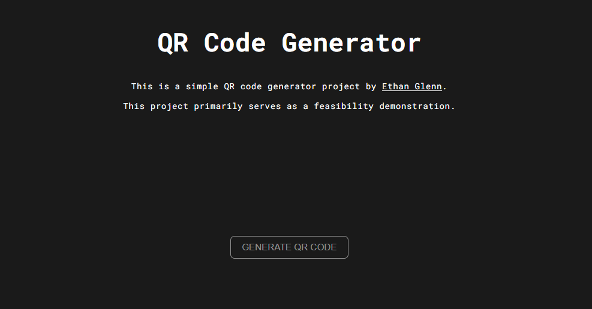
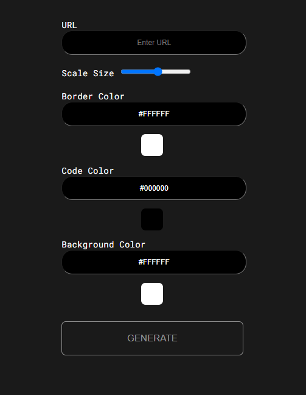
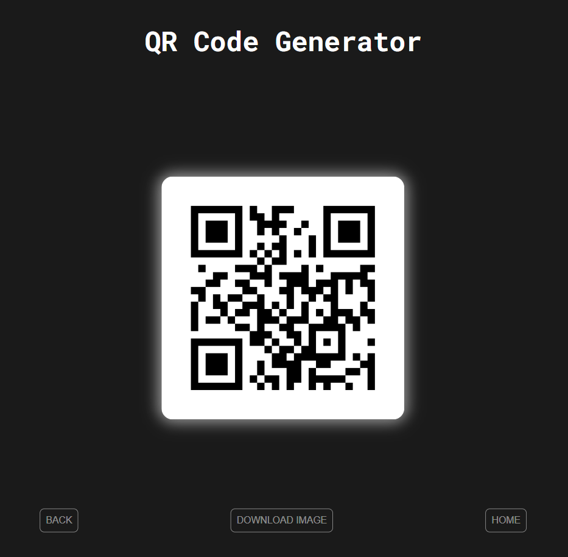

# Python QR Code Generator

Welcome to the QR Code Generator project by [Ethan Glenn](https://eglenn.dev). This project is full function and I plan on adding mroe features to it in the future.

A live production version of program is avalible at [qr.eglenn.app](https://qr.eglenn.app).

## Project Function Breakdown
View a breakdown of all function in the project [here](./docs/functions.md).

## Getting Started
### 1. Install required libraries
    pip install -r requirements.txt
### 2. Run the app file
    app.py

## Page Images
### Home Screen

### Form Page

### Generated QR Code
